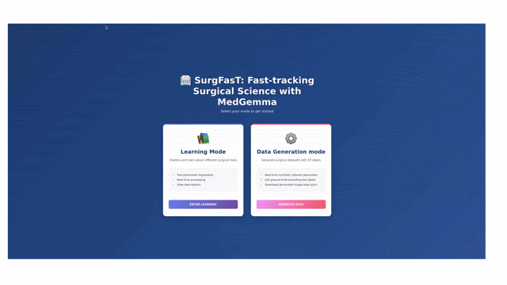
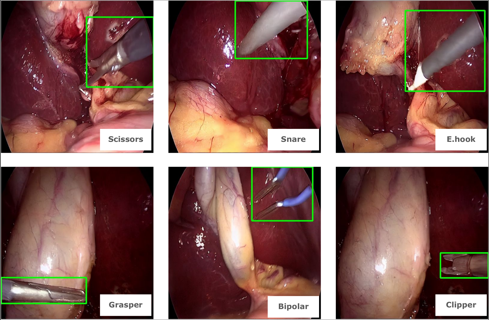

# SurgFasT

An interactive web-based tool for (i) visualizing surgical tools in a scen with description from medGemma (ii) generating synthetic surgical training images with ground gruth bounding box labels 

<p align="center">
  
</p>


## Features

- **Interactive Web GUI**: Select base images and add surgical tools with flexible positioning and rotation
- **Automatic Description Generation**: Use MedGemma to generate descriptive text for images (optional)
- **Bounding Box Generation**: Automatically compute and visualize bounding boxes for composited tools
- **Batch Processing**: Process multiple images in a single session
- **Full Download Support**: Download processed images at full resolution

<p align="center">
  
</p>

## System Requirements

- Python 3.9+
- CUDA-capable GPU with at least 12GB VRAM
- Linux (tested on Ubuntu 22.04+)

## Installation

### 1. Clone or Download the Repository

```bash
git clone <repository-url>
cd surgical-tool-composite
```

### 2. Set Up Python Environment

Create a virtual environment:

```bash
python3 -m venv venv
source venv/bin/activate  # On Windows: venv\Scripts\activate
```

### 3. Install Dependencies

```bash
pip install -r requirements.txt
```

### 4. Configure Paths

1. Copy and edit the configuration file:

```bash
cp config.yaml.example config.yaml
```

2. Update `config.yaml` with your paths:

```yaml
data:
  no_tools_images_dir: "/path/to/your/base/images"
  tool_regions_dir: "/path/to/your/tool_regions"
  output_dir: "./output"

models:
  sd_base_model: "stable-diffusion-v1-5/stable-diffusion-v1-5"
  sd_unet_checkpoint: "/path/to/your/sd-distill/checkpoint"
  huggingface_cache_dir: "/path/to/hf/cache"
  medgemma_checkpoint: "/path/to/your/medgemma/checkpoint"
```

## Data Structure

Your data should be organized as follows:

### Base Images Directory

```
no_tools_images/
├── image_001.png
├── image_002.png
├── image_003.png
...
```

### Tool Regions Directory

```
tool_regions/
├── bipolar/
│   ├── images/
│   │   ├── tool_001.png
│   │   ├── tool_002.png
│   │   ...
│   └── masks/
│       ├── tool_001.png
│       ├── tool_002.png
│       ...
├── grasper/
│   ├── images/
│   └── masks/
├── scissors/
│   ├── images/
│   └── masks/
...
```

**Note**: Each tool needs corresponding RGB images and grayscale masks where white (255) indicates the tool region.

## Usage

### Starting the Server

```bash
python run_server.py
```

The server will:
1. Initialize the ToolCompositor
2. Load the Stable Diffusion pipeline (if enabled)
3. Optionally load MedGemma and generate a session description
4. Start the Flask web server at `http://localhost:5000`

### Using the Web Interface

1. **Access the GUI**: Open `http://localhost:5000` in your browser

2. **Select Mode**:
   - **Learning Mode**: Simple interface for learning tool placement. Random rotations applied automatically.
   - **Generate Mode**: Advanced interface with control over rotation, bounding box display, and more.

3. **Select Base Images**: 4-6 surgical images are displayed. Click "Refresh Images" to load different ones.

4. **Add Tools**: 
   - Select a tool from the available options
   - Choose positioning and rotation settings
   - Click "Process" to generate the composite

5. **View Results**: 
   - See the processed image with optional bounding box
   - Download full-resolution results



### Configuration Options

#### Processing Settings

```yaml
processing:
  default_base_images: 4          # Number of images per session
  image_resolution: 512            # Processing resolution
  guidance_strength: 0.7            # SD guidance scale
  num_inference_steps: 4            # SD inference steps
```

#### GPU Settings

```yaml
gpu:
  device: "cuda"                   # cuda or cpu
  optimize_memory: true            # Enable memory optimizations
  dtype: "float32"                 # float32 or float16
```

#### Features

```yaml
features:
  use_medgemma: true               # Enable image descriptions
  use_diffusion: true              # Enable SD refinement
  draw_bboxes: true                # Draw tool bounding boxes
```

## Architecture

### Components

- **`run_server.py`**: Flask web server and API endpoints
  - `/api/base_images`: Get current base images
  - `/api/tools`: Get available tools
  - `/api/process`: Process selected images
  - `/api/download/<image_id>`: Download processed image
  - `/api/refresh_images`: Load new base images

- **`pipeline_stages.py`**: Core image processing pipeline
  - `ToolCompositor`: Manages tool loading and compositing
  - `process_composite_stage()`: Composite tool onto image + SD refinement
  - `initialize_medgemma_pipeline()`: Set up MedGemma for descriptions
  - `run_image_through_medgemma()`: Generate image descriptions

### Processing Pipeline

1. **Composite Stage**: Tool image + mask → Base image = Composite
2. **Diffusion Stage** (optional): Composite → SD Pipeline → Refined Image
3. **Description Stage** (optional): Image → MedGemma → Text Description
4. **Visualization**: Draw bounding boxes on output images

<details>
  <summary><b>Troubleshooting</b> (click to expand)</summary>

  ### Out of Memory Error

  **Solution**:
  - Set `optimize_memory: true` in GPU settings
  - Disable MedGemma: `use_medgemma: false`
  - Reduce `num_inference_steps` to 1-4
  - Use `dtype: "float16"` for lower memory usage

  ### Model Download Fails

  **Solution**:
  - Set a valid `huggingface_cache_dir` in config
  - Ensure internet connection is stable
  - Pre-download models manually:
    ```bash
    huggingface-cli download google/medgemma-1.5-4b-it --cache-dir /your/cache/path
    ```

  ### CUDA Not Found

  **Solution**:
  - Verify CUDA installation: `nvidia-smi`
  - Check PyTorch CUDA compatibility
  - Use CPU mode temporarily: Set `device: "cpu"` in config

  ### Tool Images Not Loading

  **Solution**:
  - Verify `tool_regions_dir` structure matches expected layout
  - Ensure all tools have both `images/` and `masks/` subdirectories
  - Check file permissions on data directories

</details>

## Advanced Usage

### Processing via Python Script

```python
from pipeline_stages import ToolCompositor, load_config

# Load configuration
config = load_config('config.yaml')

# Initialize compositor
compositor = ToolCompositor(
    no_tools_dir=config['data']['no_tools_images_dir'],
    tool_regions_dir=config['data']['tool_regions_dir'],
    output_dir=config['data']['output_dir']
)

# Load and composite a tool
tool_img, tool_mask = compositor.load_tool_sample('grasper', sample_idx=0)
base_img = Image.open('base_image.png').convert('RGB')
composite = compositor.paste_tool_excluding_white(base_img, tool_img, position=(10, 10))
```

### Custom Prompts for Stable Diffusion

Edit the prompt in `process_composite_stage()`:

```python
pipeline_args = {
    "prompt": "your custom prompt here",
    "guidance_scale": 4.5,
    ...
}
```

## Future Enhancements

- Multi-GPU support for parallel processing
- Additional tool placement strategies (random, grid-based)
- Custom prompt templates
- Batch processing from command-line
- Docker containerization

## Citation

If you use this tool in your research, please cite:

```bibtex
@software{surgfast,
  title={SurgFasT: Fast-tracking Surgical science with medGemma},
  author={Danush Kumar Venkatesh},
  year={2026},
}
```

## Support

For issues, questions, or contributions:
- Open an issue on GitHub
- Check existing issues for solutions
- Review the configuration guide above

## Acknowledgments

- Stable Diffusion pipeline from [Hugging Face Diffusers](https://github.com/huggingface/diffusers)
- MedGemma model from [Google](https://huggingface.co/collections/google/health-ai-developer-foundations-hai-def)
